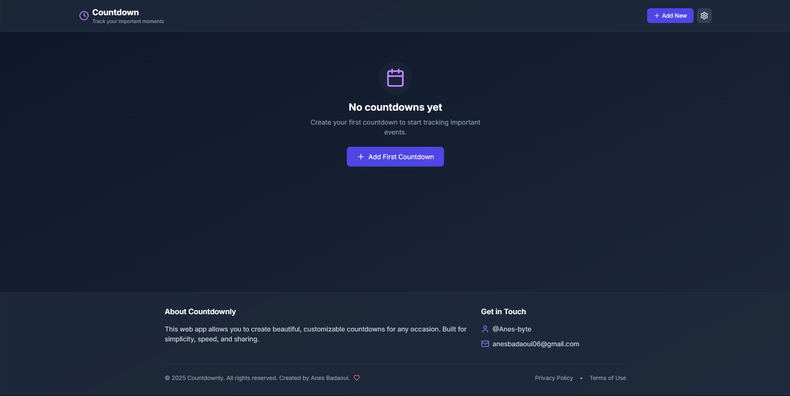
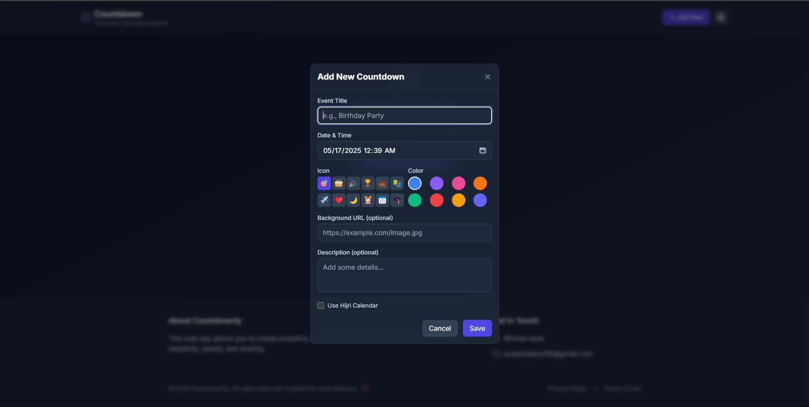

# Countdownly ⏳

A clean, modern countdown timer web app built with Vite, React, TypeScript, and Tailwind CSS.

Easily create and manage multiple countdowns for your important events with a smooth dark mode UI, real-time updates, and sharing features.

## 🔥 Preview

### Home Page:




## 🚀 Features

- Create and customize multiple countdowns  
- Dark mode by default for a sleek modern look  
- Real-time countdown updates (days, hours, minutes, seconds)  
- Edit/delete countdowns anytime  
- Shareable links  
- Fully responsive  
- Minimal and fast loading

## 📦 Tech Stack

- **React** (w/ TypeScript)  
- **Tailwind CSS**  
- **Vite**  
- **ESLint & Prettier** for clean code  
- **Context API + Custom Hooks** for state management

## 🛠️ Getting Started

### 1. Clone the repo

```bash
git clone https://github.com/Anes-byte/countdownly.git
cd countdownly
````

### 2. Install dependencies

```bash
npm install
```

### 3. Start the dev server

```bash
npm run dev
```

App will be running at: [http://localhost:5173](http://localhost:5173)

## 🧑‍💻 Developer

Made with ❤️ by [@Anes-byte](https://github.com/Anes-byte)
📬 Contact: **[anesbadaoui06@gmail.com](mailto:anesbadaoui06@gmail.com)**

## 📄 License

© 2025 Countdownly. All rights reserved.
This project is open source and intended for personal and educational use only.

